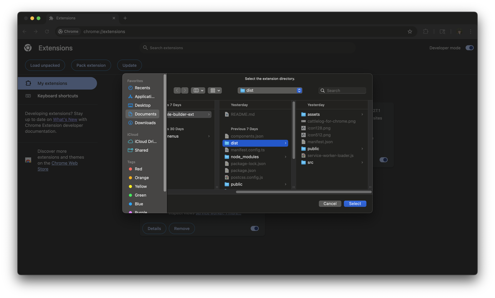

Hi! I built a Chrome extension for Schedule Builder which I believe would be a valuable 
asset to Cattlelog's product stack.

## Problem

Searching for classes every quarter is a **tedious** process.

Students have to switch between Schedule Builder and Rate My Professor to find the best 
possible instructor.

**BUT** the problem is...

- Rate My Professor has a **ton of ads** that make it **difficult to navigate**
- Their website is **extremely slow** during schedule building time
- And users spend **lots of time** searching up **EVERY** professor for **EVERY SINGLE** class

## Solution / Features

| Screenshot 1 | Screenshot 2 |
|--------------|--------------|
|||

### 1. Calendar Export
- Users can export their classes to their calendar of choice (Google, Apple, Microsoft, etc.)
- ***Why it's important:*** Users can **save time** from manually creating an event for each lecture, discussion, lab, etc

### 2. Estimated Weekly Workload
- Extension estimates how many hours per week a user will be spending on school
- ***Why it's important:*** Users can plan their schedule better and **avoid overloading** themselves

### 3. RMP Ratings
- Users can see professor ratings of their selected classes on the extension itself
- ***Why it's important:*** Users don't need to **waste time** switching between Schedule Builder and Rate My Professor


### 4. New RMP Column
- Users can see professor ratings for each class on Schedule Builder itself
- ***Why it's important:*** Users don't need to **waste time** switching between Schedule Builder and Rate My Professor
- ***Reminder:*** Rate My Professor's website is **slow** and **filled with ads**, making it **frustrating** to use

### 5. RMP Column Filters
- Users can filter classes based on their preferred instructor rating
- ***Why it's important:*** Users don't need to spend time looking up **EVERY SINGLE** professor to find the best one

### 6. Direct Links to Cattlelog
- Users can click on a class or professor to see more details on Cattlelog
- ***Why it's important:*** User's don't need to search for a class or professor since they now have a **direct link** 
to more details (on Cattlelog)

## Try it out

1. Clone this repository:
   ```bash
   git clone https://github.com/sohandillikar/schedule-builder-ext.git
   ```
   OR click [here](https://github.com/sohandillikar/schedule-builder-ext/archive/refs/heads/main.zip) to download the .zip file 
   and then unzip it.

2. Load in Chrome:
   - Open Chrome and go to `chrome://extensions/`
   - Enable "Developer mode"
   - Click "Load unpacked"
   - Select the `dist` folder from this project




## Dev Issues

### 1. Cattlelog API
`api.daviscattlelog.com` does not accept ORIGIN `chrome-extension://` so for the time being, I 
downloaded all course data and stored it in a JSON file.

```typescript
import allCattlelogCourses from "@/all_cattlelog_courses.json";

function fetchAllCourses(): any {
   // TODO: Talk to Jake to get this API to work for origin chrome-extension://
   // const url = "https://api.daviscattlelog.com/courses/all";
   return allCattlelogCourses;
}
```

### 2. Quarter Dates
I manually logged the start and end dates for each quarter so that the calendar export would 
only create events between those dates. I want to create a better approach for fetching these dates.

```typescript
// First and last days of instruction
// TODO: Find a better way to fetch this data
export const QUARTER_DATES = {
    summer_session_1_2025: {start: "2025-06-23", end: "2025-08-01"},
    summer_session_2_2025: {start: "2025-08-04", end: "2025-09-12"},
    summer_special_session_2025: {start: "2025-06-13", end: "2025-09-12"},
    fall_quarter_2025: {start: "2025-09-24", end: "2025-12-05"},
    winter_quarter_2026: {start: "2026-01-05", end: "2026-03-13"},
    spring_quarter_2026: {start: "2026-03-30", end: "2026-06-04"}
};
```

### 3. Schedule Builder Course Retrieval
Schedule Builder course search only retrieves as many courses fit on your screen at a time. 
So if your screen can only fit 5 courses, it will only retrieve and display 5 courses. As you 
scroll down, it will retrieve and display more.

**Problem:** If you filter for classes with a professor rating of 4/5 and above and the first 5 
classes shown don't meet that requirement, no classes will be shown even if some exist. You need 
to scroll down (just a tiny bit) for schedule builder to render them.


## Next Steps

If you guys like this product...

1. Fix dev issues
2. Publish to Chrome Web Store!
